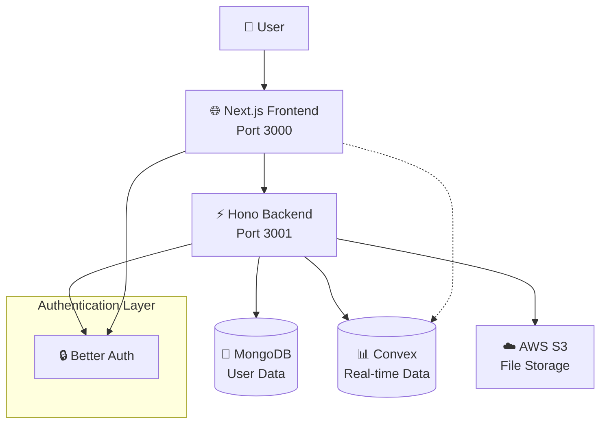
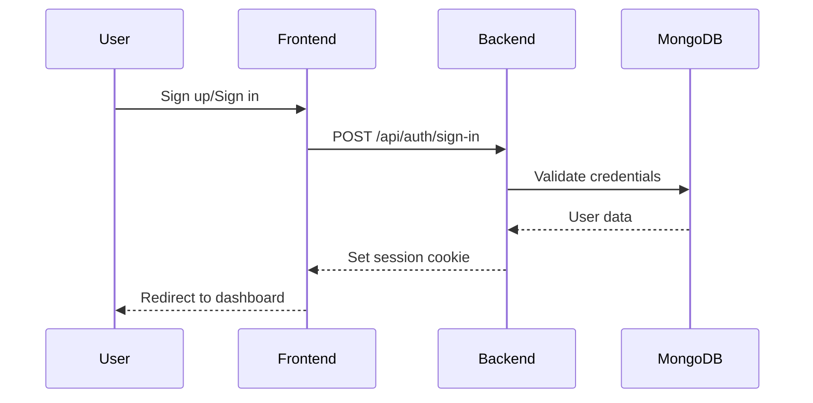
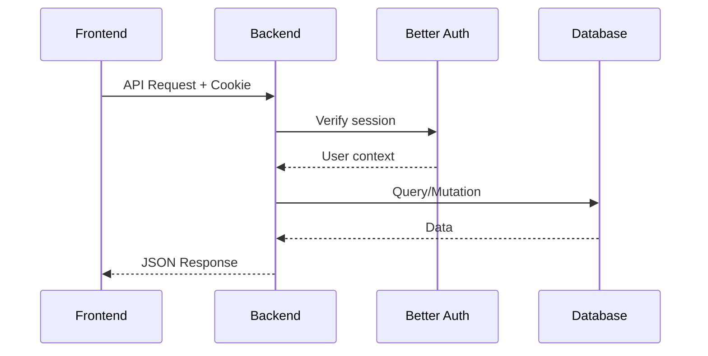
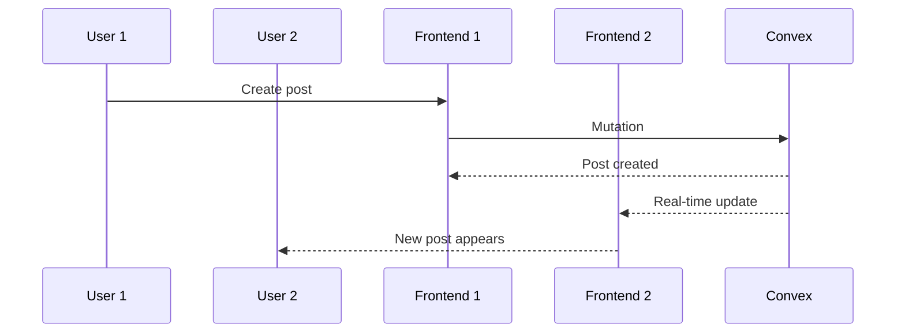

# Architecture

Layer0 follows a modern, scalable full-stack architecture designed for developer productivity and application performance.

## System Overview



## Core Components

### Frontend (Next.js + React Router)

The frontend is built with Next.js but configured for **client-side only** rendering using React Router for navigation.

**Key Features:**

- 🎨 **Tailwind CSS** for styling with shadcn/ui components
- 🌓 **Dark/Light theme** support with next-themes
- 🛡️ **Protected routes** with authentication context
- 📱 **Responsive design** for mobile and desktop
- ⚡ **Fast navigation** with React Router

**Technology Stack:**

- Next.js 15.3.1
- React 19
- React Router 7.6.1
- Tailwind CSS 4
- TypeScript 5

### Backend (Hono API Server)

A lightweight, fast API server built with Hono providing RESTful endpoints.

**Key Features:**

- 🚀 **High performance** with Hono's lightweight framework
- 🔒 **Authentication** integration with Better Auth
- 🗄️ **Database** connections to MongoDB and Convex
- 📁 **File uploads** to AWS S3
- 🌐 **CORS** configured for frontend communication

**Technology Stack:**

- Hono 4.7.11
- Better Auth 1.2.8
- MongoDB 6.17.0
- Node.js with TypeScript

### Database Layer

Layer0 uses a dual-database approach for different use cases:

#### MongoDB (Primary Database)

- **Purpose**: User authentication and persistent data
- **Usage**: Better Auth user sessions, profiles, settings
- **Benefits**: Mature, reliable, excellent for user data

#### Convex (Real-time Database)

- **Purpose**: Real-time features and dynamic content
- **Usage**: Posts, comments, likes, real-time updates
- **Benefits**: Built-in real-time subscriptions, TypeScript-first

### Authentication (Better Auth)

Comprehensive authentication system with modern security practices.

**Features:**

- 📧 **Email/Password** authentication
- 🍪 **Secure sessions** with HTTP-only cookies
- 🔄 **Session management** with automatic refresh
- 🛡️ **CSRF protection** built-in
- 🔒 **Password hashing** with bcrypt

## Data Flow

### Authentication Flow



### API Request Flow



### Real-time Data Flow



## File Structure

```
layer0/
├── backend/                 # Hono API server
│   ├── src/
│   │   ├── index.ts        # Main server entry
│   │   ├── lib/
│   │   │   ├── auth.ts     # Better Auth config
│   │   │   ├── database.ts # MongoDB connection
│   │   │   └── s3.ts       # AWS S3 client
│   │   └── routes/         # API route handlers
│   ├── convex/             # Convex schema & functions
│   │   ├── schema.ts       # Data models
│   │   ├── posts.ts        # Post operations
│   │   ├── likes.ts        # Like operations
│   │   └── comments.ts     # Comment operations
│   └── package.json
├── frontend/               # Next.js frontend
│   ├── src/
│   │   ├── app/           # Next.js app directory
│   │   ├── components/    # React components
│   │   │   ├── auth/      # Auth-related components
│   │   │   ├── providers/ # React context providers
│   │   │   └── ui/        # Reusable UI components
│   │   ├── lib/           # Utility libraries
│   │   ├── hooks/         # Custom React hooks
│   │   └── routes/        # Route components
│   └── package.json
├── docs/                   # Documentation (Fumadocs)
└── package.json           # Root workspace config
```

## Security Architecture

### Authentication Security

- **Secure Cookies**: HTTP-only, SameSite, Secure flags
- **Session Management**: Automatic rotation and expiry
- **Password Security**: bcrypt hashing with salt
- **CSRF Protection**: Built into Better Auth

### API Security

- **CORS Configuration**: Restricted to trusted origins
- **Input Validation**: Request validation on all endpoints
- **Environment Variables**: Sensitive data in env files
- **TypeScript**: Compile-time type safety

## Scalability Considerations

### Horizontal Scaling

- **Stateless Backend**: Easy to scale with load balancers
- **Database Scaling**: MongoDB replica sets, Convex auto-scales
- **CDN Integration**: S3 + CloudFront for static assets

### Performance Optimizations

- **Client-Side Routing**: Fast navigation with React Router
- **Code Splitting**: Next.js automatic code splitting
- **Image Optimization**: Built-in Next.js image optimization
- **Caching**: Browser caching, API response caching

## Development vs Production

### Development

- **Hot Reload**: Automatic code reloading
- **Source Maps**: Debugging support
- **Local Databases**: MongoDB local instance
- **Development Logging**: Detailed error messages

### Production

- **Optimized Builds**: Minified, tree-shaken code
- **Environment Variables**: Production secrets
- **Database Clusters**: MongoDB Atlas, Convex Cloud
- **Error Monitoring**: Production error tracking

## Next Steps

<Cards>
  <Card title="Backend Development" href="/docs/backend" icon="⚡">
    Learn about the Hono backend implementation
  </Card>
  <Card title="Frontend Development" href="/docs/frontend" icon="🌐">
    Explore the Next.js + React Router frontend
  </Card>
  <Card title="Database Guide" href="/docs/database" icon="📊">
    Understanding MongoDB and Convex integration
  </Card>
  <Card title="Authentication Deep Dive" href="/docs/authentication" icon="🔒">
    Master Better Auth implementation
  </Card>
</Cards>
