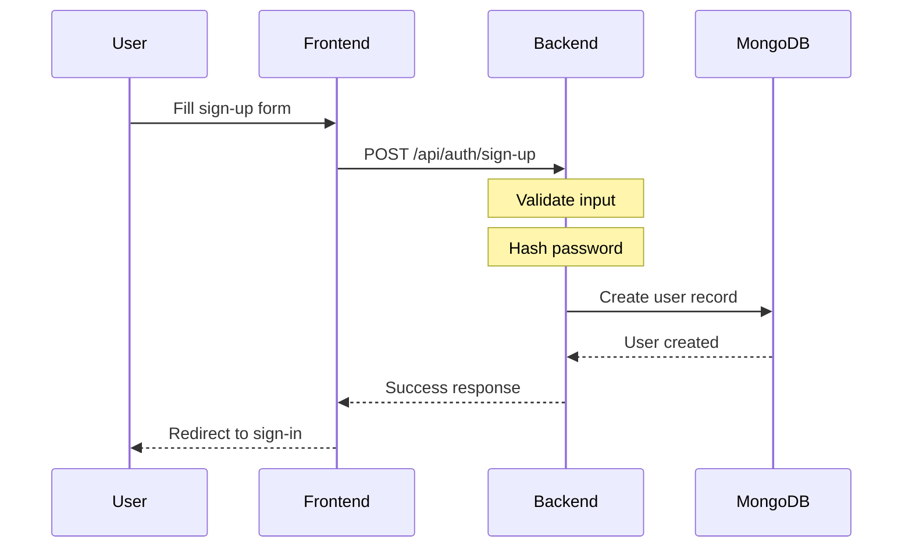
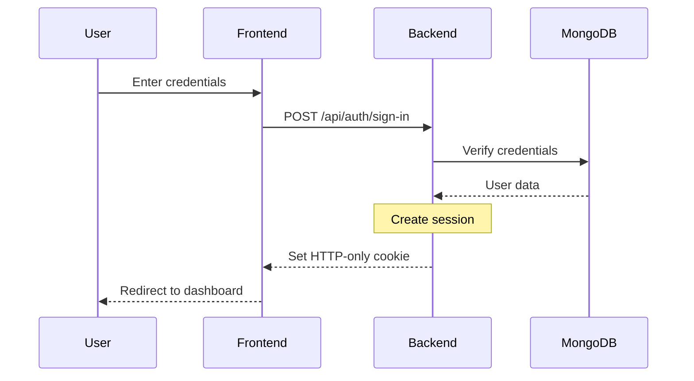

# Authentication

Layer0 uses [Better Auth](https://better-auth.com) for a modern, secure, and developer-friendly authentication system.

## Overview

Better Auth provides a comprehensive authentication solution with:

- 🔒 **Secure by default** with built-in CSRF protection
- 🍪 **Session management** using HTTP-only cookies
- 🔄 **Automatic session refresh** and rotation
- 🛡️ **Type-safe** with full TypeScript support
- 📱 **Framework agnostic** but optimized for React

## Configuration

### Backend Configuration

The backend authentication is configured in `backend/src/lib/auth.ts`:

```typescript title="backend/src/lib/auth.ts"
import { betterAuth } from "better-auth";
import { mongodbAdapter } from "better-auth/adapters/mongodb";
import Database from "./database";

export const auth = betterAuth({
  database: mongodbAdapter(Database),
  emailAndPassword: {
    enabled: true,
    requireEmailVerification: false, // Set to true in production
  },
  session: {
    expiresIn: 60 * 60 * 24 * 7, // 7 days
    updateAge: 60 * 60 * 24, // 1 day
  },
  trustedOrigins: ["http://localhost:3000"], // Add production URLs
  secret: process.env.BETTER_AUTH_SECRET!,
  baseURL: process.env.BETTER_AUTH_URL!,
});

export type Session = typeof auth.$Infer.Session;
export type User = typeof auth.$Infer.User;
```

### Frontend Configuration

The frontend client is configured in `frontend/src/lib/auth.ts`:

```typescript title="frontend/src/lib/auth.ts"
import { createAuthClient } from "better-auth/react";

export const authClient = createAuthClient({
  baseURL: "http://localhost:3001", // Update for production
});

export const { signIn, signUp, signOut, useSession } = authClient;
```

## Authentication Flow

### Sign Up Process



### Sign In Process



## Implementation Guide

### Sign Up Component

```typescript title="components/auth/sign-up-form.tsx"
"use client";

import { useState } from "react";
import { signUp } from "@/lib/auth";
import { Button } from "@/components/ui/button";

export function SignUpForm() {
  const [email, setEmail] = useState("");
  const [password, setPassword] = useState("");
  const [loading, setLoading] = useState(false);

  const handleSubmit = async (e: React.FormEvent) => {
    e.preventDefault();
    setLoading(true);

    try {
      await signUp.email({
        email,
        password,
        name: email.split("@")[0], // Use email prefix as name
      });
      // Redirect to sign-in or dashboard
    } catch (error) {
      console.error("Sign up failed:", error);
    } finally {
      setLoading(false);
    }
  };

  return (
    <form onSubmit={handleSubmit} className="space-y-4">
      <input
        type="email"
        value={email}
        onChange={(e) => setEmail(e.target.value)}
        placeholder="Email"
        required
      />
      <input
        type="password"
        value={password}
        onChange={(e) => setPassword(e.target.value)}
        placeholder="Password"
        required
      />
      <Button type="submit" disabled={loading}>
        {loading ? "Creating account..." : "Sign Up"}
      </Button>
    </form>
  );
}
```

### Sign In Component

```typescript title="components/auth/sign-in-form.tsx"
"use client";

import { useState } from "react";
import { signIn } from "@/lib/auth";
import { Button } from "@/components/ui/button";

export function SignInForm() {
  const [email, setEmail] = useState("");
  const [password, setPassword] = useState("");
  const [loading, setLoading] = useState(false);

  const handleSubmit = async (e: React.FormEvent) => {
    e.preventDefault();
    setLoading(true);

    try {
      await signIn.email({
        email,
        password,
      });
      // Redirect handled by auth provider
    } catch (error) {
      console.error("Sign in failed:", error);
    } finally {
      setLoading(false);
    }
  };

  return (
    <form onSubmit={handleSubmit} className="space-y-4">
      <input
        type="email"
        value={email}
        onChange={(e) => setEmail(e.target.value)}
        placeholder="Email"
        required
      />
      <input
        type="password"
        value={password}
        onChange={(e) => setPassword(e.target.value)}
        placeholder="Password"
        required
      />
      <Button type="submit" disabled={loading}>
        {loading ? "Signing in..." : "Sign In"}
      </Button>
    </form>
  );
}
```

### Protected Routes

```typescript title="components/auth/protected-route.tsx"
"use client";

import { useSession } from "@/lib/auth";
import { useEffect } from "react";
import { useNavigate } from "react-router";

interface ProtectedRouteProps {
  children: React.ReactNode;
}

export function ProtectedRoute({ children }: ProtectedRouteProps) {
  const { data: session, isPending } = useSession();
  const navigate = useNavigate();

  useEffect(() => {
    if (!isPending && !session) {
      navigate("/auth");
    }
  }, [session, isPending, navigate]);

  if (isPending) {
    return <div>Loading...</div>;
  }

  if (!session) {
    return null;
  }

  return <>{children}</>;
}
```

### Auth Context Provider

```typescript title="components/providers/auth.tsx"
"use client";

import { createContext, useContext, useEffect, useState } from "react";
import { useSession, signOut } from "@/lib/auth";
import type { User } from "@/lib/auth";

interface AuthContextType {
  user: User | null;
  loading: boolean;
  signOut: () => Promise<void>;
}

const AuthContext = createContext<AuthContextType | undefined>(undefined);

export function AuthProvider({ children }: { children: React.ReactNode }) {
  const { data: session, isPending } = useSession();
  const [user, setUser] = useState<User | null>(null);

  useEffect(() => {
    setUser(session?.user ?? null);
  }, [session]);

  const handleSignOut = async () => {
    await signOut();
    setUser(null);
  };

  return (
    <AuthContext.Provider
      value={{
        user,
        loading: isPending,
        signOut: handleSignOut,
      }}
    >
      {children}
    </AuthContext.Provider>
  );
}

export function useAuth() {
  const context = useContext(AuthContext);
  if (context === undefined) {
    throw new Error("useAuth must be used within an AuthProvider");
  }
  return context;
}
```

## Session Management

### Session Configuration

Sessions are configured with these settings:

- **Expires In**: 7 days by default
- **Update Age**: Sessions are refreshed every 24 hours
- **Secure**: HTTP-only cookies for security
- **SameSite**: CSRF protection

### Session Hooks

```typescript
import { useSession } from "@/lib/auth";

function Dashboard() {
  const { data: session, isPending, error } = useSession();

  if (isPending) return <div>Loading...</div>;
  if (error) return <div>Error loading session</div>;
  if (!session) return <div>Not authenticated</div>;

  return (
    <div>
      <h1>Welcome, {session.user.name}!</h1>
      <p>Email: {session.user.email}</p>
    </div>
  );
}
```

## Security Features

### Password Security

- **Hashing**: bcrypt with automatic salt generation
- **Validation**: Minimum requirements (implement as needed)
- **Storage**: Never stored in plain text

### Session Security

- **HTTP-Only Cookies**: Cannot be accessed by JavaScript
- **Secure Flag**: Only sent over HTTPS in production
- **SameSite**: Protection against CSRF attacks
- **Automatic Rotation**: Sessions are refreshed regularly

### CSRF Protection

Better Auth includes built-in CSRF protection:

- **Double Submit Cookie**: Validates CSRF tokens
- **SameSite Cookies**: Additional CSRF protection
- **Origin Validation**: Checks request origins

## Environment Variables

Required environment variables for authentication:

```bash title="backend/.env"
# Required - Change in production!
BETTER_AUTH_SECRET=your-secret-key-change-this-in-production-layer0-auth-2024

# Backend URL
BETTER_AUTH_URL=http://localhost:3001

# Database
MONGODB_URI=mongodb://localhost:27017/layer0-auth
```

<Callout type="warn">
  **Security**: The `BETTER_AUTH_SECRET` should be a strong, random string in
  production!
</Callout>

## Testing Authentication

### Manual Testing

1. **Sign Up**: Create a new account at `/auth`
2. **Sign In**: Authenticate with your credentials
3. **Protected Routes**: Try accessing `/dashboard` without authentication
4. **Sign Out**: Log out and verify session is cleared

### Programmatic Testing

```typescript
// Test sign up
const signUpResult = await fetch("http://localhost:3001/api/auth/sign-up", {
  method: "POST",
  headers: { "Content-Type": "application/json" },
  body: JSON.stringify({
    email: "test@example.com",
    password: "password123",
    name: "Test User",
  }),
});

// Test sign in
const signInResult = await fetch("http://localhost:3001/api/auth/sign-in", {
  method: "POST",
  headers: { "Content-Type": "application/json" },
  body: JSON.stringify({
    email: "test@example.com",
    password: "password123",
  }),
});
```

## Advanced Features

### Email Verification

To enable email verification in production:

```typescript title="backend/src/lib/auth.ts"
export const auth = betterAuth({
  // ... other config
  emailAndPassword: {
    enabled: true,
    requireEmailVerification: true,
  },
  emailVerification: {
    sendOnSignUp: true,
    autoSignInAfterVerification: true,
  },
});
```

### Two-Factor Authentication

Better Auth supports 2FA with TOTP:

```typescript
import { twoFactor } from "better-auth/plugins";

export const auth = betterAuth({
  // ... other config
  plugins: [
    twoFactor({
      issuer: "Layer0",
    }),
  ],
});
```

## Troubleshooting

### Common Issues

**Session Not Persisting**

- Check that cookies are being set correctly
- Verify `trustedOrigins` includes your frontend URL
- Ensure `BETTER_AUTH_SECRET` is set

**CORS Errors**

- Add your frontend URL to `trustedOrigins`
- Check CORS configuration in your Hono server

**TypeScript Errors**

- Ensure types are properly exported and imported
- Check that `better-auth/react` is installed

## Migration Guide

### From Other Auth Solutions

If migrating from other authentication systems:

1. **Export user data** from your current system
2. **Hash passwords** using bcrypt if not already
3. **Import users** to MongoDB with Better Auth schema
4. **Update frontend** to use Better Auth hooks
5. **Test authentication flow** thoroughly

## Next Steps

<Cards>
  <Card title="Backend API" href="/docs/backend" icon="⚡">
    Learn about protecting API endpoints
  </Card>
  <Card title="Frontend Routes" href="/docs/frontend" icon="🌐">
    Implement protected frontend routes
  </Card>
  <Card title="User Management" href="/docs/user-management" icon="👥">
    Advanced user management features
  </Card>
  <Card title="Security Best Practices" href="/docs/security" icon="🛡️">
    Comprehensive security guidelines
  </Card>
</Cards>
