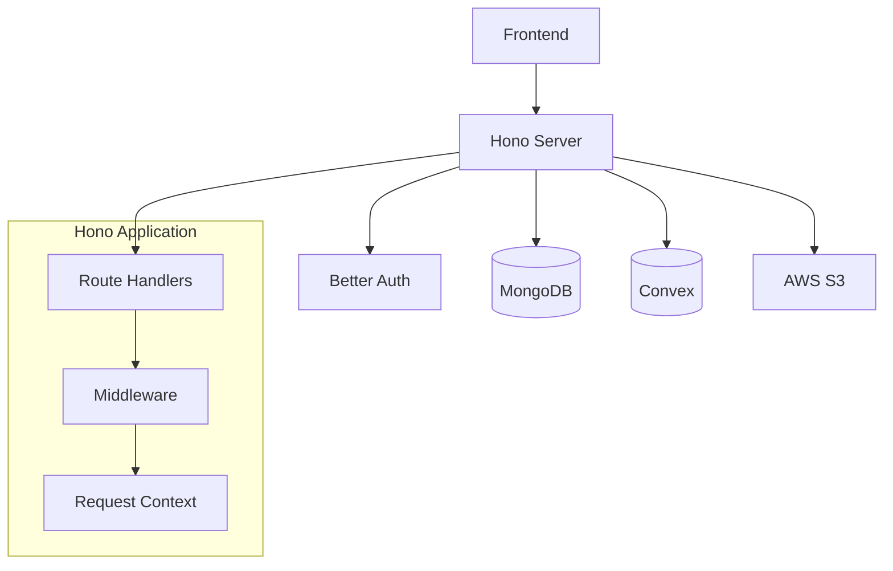

# Backend Development

The Layer0 backend is built with [Hono](https://hono.dev/), a lightweight and fast web framework for Node.js, providing a modern API server with TypeScript support.

## Overview

The backend serves as the API layer for the Layer0 application, handling:

- 🔒 **Authentication** with Better Auth integration
- 🗄️ **Database operations** with MongoDB and Convex
- 📁 **File uploads** to AWS S3
- 🌐 **API endpoints** for frontend communication
- 🛡️ **Security** with CORS and request validation

## Architecture



## Project Structure

```
backend/
├── src/
│   ├── index.ts          # Main server entry point
│   ├── lib/              # Core utilities
│   │   ├── auth.ts       # Better Auth configuration
│   │   ├── database.ts   # MongoDB connection
│   │   ├── convex.ts     # Convex client setup
│   │   └── s3.ts         # AWS S3 client
│   └── routes/           # API route handlers
│       ├── users.ts      # User management endpoints
│       ├── posts.ts      # Post CRUD operations
│       ├── likes.ts      # Like functionality
│       └── comments.ts   # Comment operations
├── convex/               # Convex schema and functions
│   ├── schema.ts         # Database schema
│   ├── posts.ts          # Post operations
│   ├── likes.ts          # Like operations
│   └── comments.ts       # Comment operations
└── package.json
```

## Server Setup

### Main Server File

```typescript title="src/index.ts"
import { serve } from "@hono/node-server";
import { Hono } from "hono";
import { cors } from "hono/cors";
import { logger } from "hono/logger";
import { auth } from "./lib/auth";

// Import route handlers
import userRoutes from "./routes/users";
import postRoutes from "./routes/posts";
import likeRoutes from "./routes/likes";
import commentRoutes from "./routes/comments";

const app = new Hono();

// Middleware
app.use("*", logger());
app.use(
  "*",
  cors({
    origin: ["http://localhost:3000"], // Add production URLs
    credentials: true,
  })
);

// Health check
app.get("/", (c) => {
  return c.json({ message: "Layer0 Backend API", status: "healthy" });
});

// Auth routes (Better Auth handles these automatically)
app.on(["POST", "GET"], "/api/auth/**", (c) => {
  return auth.handler(c.req.raw);
});

// API routes
app.route("/api/users", userRoutes);
app.route("/api/posts", postRoutes);
app.route("/api/likes", likeRoutes);
app.route("/api/comments", commentRoutes);

const port = parseInt(process.env.PORT || "3001");

console.log(`🚀 Server running on http://localhost:${port}`);

serve({
  fetch: app.fetch,
  port,
});
```

## Authentication Middleware

### Session Verification

```typescript title="lib/auth.ts"
import { Context, Next } from "hono";
import { auth } from "./auth";

export async function requireAuth(c: Context, next: Next) {
  const session = await auth.api.getSession({
    headers: c.req.header(),
  });

  if (!session) {
    return c.json({ error: "Unauthorized" }, 401);
  }

  // Add user to context
  c.set("user", session.user);
  c.set("session", session.session);

  await next();
}

export async function optionalAuth(c: Context, next: Next) {
  const session = await auth.api.getSession({
    headers: c.req.header(),
  });

  if (session) {
    c.set("user", session.user);
    c.set("session", session.session);
  }

  await next();
}
```

## Route Handlers

### User Routes

```typescript title="routes/users.ts"
import { Hono } from "hono";
import { requireAuth } from "../lib/auth";

const app = new Hono();

// Get current user profile
app.get("/me", requireAuth, async (c) => {
  const user = c.get("user");
  return c.json({ user });
});

// Update user profile
app.patch("/me", requireAuth, async (c) => {
  const user = c.get("user");
  const body = await c.req.json();

  // Validate and update user data
  // Implementation depends on your user schema

  return c.json({ message: "Profile updated", user });
});

// Get user by ID
app.get("/:id", async (c) => {
  const id = c.req.param("id");

  // Fetch user from database
  // Return public user information only

  return c.json({ user: { id, name: "User Name" } });
});

export default app;
```

### Post Routes

```typescript title="routes/posts.ts"
import { Hono } from "hono";
import { requireAuth, optionalAuth } from "../lib/auth";
import { api } from "../lib/convex";

const app = new Hono();

// Get all posts (public)
app.get("/", optionalAuth, async (c) => {
  const user = c.get("user");

  try {
    const posts = await api.query("posts:list", {
      userId: user?.id,
    });

    return c.json({ posts });
  } catch (error) {
    return c.json({ error: "Failed to fetch posts" }, 500);
  }
});

// Create a new post (protected)
app.post("/", requireAuth, async (c) => {
  const user = c.get("user");
  const { content, imageUrl } = await c.req.json();

  if (!content?.trim()) {
    return c.json({ error: "Content is required" }, 400);
  }

  try {
    const post = await api.mutation("posts:create", {
      content: content.trim(),
      authorAuthId: user.id,
      imageUrl,
    });

    return c.json({ post }, 201);
  } catch (error) {
    return c.json({ error: "Failed to create post" }, 500);
  }
});

// Get post by ID
app.get("/:id", optionalAuth, async (c) => {
  const id = c.req.param("id");
  const user = c.get("user");

  try {
    const post = await api.query("posts:getById", {
      id: id as Id<"posts">,
      userId: user?.id,
    });

    if (!post) {
      return c.json({ error: "Post not found" }, 404);
    }

    return c.json({ post });
  } catch (error) {
    return c.json({ error: "Failed to fetch post" }, 500);
  }
});

// Update post (protected)
app.patch("/:id", requireAuth, async (c) => {
  const id = c.req.param("id");
  const user = c.get("user");
  const { content } = await c.req.json();

  try {
    const post = await api.mutation("posts:update", {
      id: id as Id<"posts">,
      content,
      userId: user.id,
    });

    return c.json({ post });
  } catch (error) {
    return c.json({ error: "Failed to update post" }, 500);
  }
});

// Delete post (protected)
app.delete("/:id", requireAuth, async (c) => {
  const id = c.req.param("id");
  const user = c.get("user");

  try {
    await api.mutation("posts:delete", {
      id: id as Id<"posts">,
      userId: user.id,
    });

    return c.json({ message: "Post deleted" });
  } catch (error) {
    return c.json({ error: "Failed to delete post" }, 500);
  }
});

export default app;
```

### File Upload Routes

```typescript title="routes/uploads.ts"
import { Hono } from "hono";
import { requireAuth } from "../lib/auth";
import { uploadToS3 } from "../lib/s3";

const app = new Hono();

// Upload image
app.post("/image", requireAuth, async (c) => {
  const user = c.get("user");

  try {
    const formData = await c.req.formData();
    const file = formData.get("file") as File;

    if (!file) {
      return c.json({ error: "No file provided" }, 400);
    }

    // Validate file type
    if (!file.type.startsWith("image/")) {
      return c.json({ error: "Only images are allowed" }, 400);
    }

    // Validate file size (e.g., 5MB max)
    const maxSize = 5 * 1024 * 1024; // 5MB
    if (file.size > maxSize) {
      return c.json({ error: "File too large" }, 400);
    }

    const url = await uploadToS3(file, user.id);

    return c.json({ url });
  } catch (error) {
    return c.json({ error: "Upload failed" }, 500);
  }
});

export default app;
```

## Database Integration

### MongoDB Connection

```typescript title="lib/database.ts"
import { MongoClient, Db } from "mongodb";

const uri = process.env.MONGODB_URI!;

if (!uri) {
  throw new Error("MONGODB_URI environment variable is required");
}

let client: MongoClient;
let database: Db;

async function connectToDatabase(): Promise<Db> {
  if (database) {
    return database;
  }

  try {
    client = new MongoClient(uri);
    await client.connect();
    database = client.db();

    console.log("✅ Connected to MongoDB");
    return database;
  } catch (error) {
    console.error("❌ MongoDB connection error:", error);
    throw error;
  }
}

export default connectToDatabase();
```

### Convex Client

```typescript title="lib/convex.ts"
import { ConvexHttpClient } from "convex/browser";

const deploymentUrl = process.env.CONVEX_DEPLOYMENT!;

if (!deploymentUrl) {
  throw new Error("CONVEX_DEPLOYMENT environment variable is required");
}

export const api = new ConvexHttpClient(deploymentUrl);
```

## Error Handling

### Global Error Handler

```typescript title="middleware/error-handler.ts"
import { Context } from "hono";

export function errorHandler(error: Error, c: Context) {
  console.error("API Error:", error);

  // Development vs Production error responses
  if (process.env.NODE_ENV === "development") {
    return c.json(
      {
        error: error.message,
        stack: error.stack,
      },
      500
    );
  }

  return c.json(
    {
      error: "Internal server error",
    },
    500
  );
}
```

### Request Validation

```typescript title="lib/validation.ts"
import { z } from "zod";
import { Context, Next } from "hono";

export const validateBody = (schema: z.ZodSchema) => {
  return async (c: Context, next: Next) => {
    try {
      const body = await c.req.json();
      const validated = schema.parse(body);
      c.set("validatedBody", validated);
      await next();
    } catch (error) {
      if (error instanceof z.ZodError) {
        return c.json(
          {
            error: "Validation failed",
            details: error.errors,
          },
          400
        );
      }
      throw error;
    }
  };
};

// Usage example
export const createPostSchema = z.object({
  content: z.string().min(1).max(500),
  imageUrl: z.string().url().optional(),
});
```

## Testing

### Unit Tests

```typescript title="tests/routes/posts.test.ts"
import { describe, it, expect } from "vitest";
import { app } from "../src/index";

describe("Posts API", () => {
  it("should get all posts", async () => {
    const res = await app.request("/api/posts");
    expect(res.status).toBe(200);

    const data = await res.json();
    expect(data).toHaveProperty("posts");
  });

  it("should require auth for creating posts", async () => {
    const res = await app.request("/api/posts", {
      method: "POST",
      body: JSON.stringify({ content: "Test post" }),
      headers: { "Content-Type": "application/json" },
    });

    expect(res.status).toBe(401);
  });
});
```

### Integration Tests

```typescript title="tests/integration/auth.test.ts"
import { describe, it, expect, beforeAll } from "vitest";
import { app } from "../src/index";

describe("Authentication Flow", () => {
  let sessionCookie: string;

  beforeAll(async () => {
    // Create test user and get session
    const signUpRes = await app.request("/api/auth/sign-up", {
      method: "POST",
      body: JSON.stringify({
        email: "test@example.com",
        password: "password123",
        name: "Test User",
      }),
      headers: { "Content-Type": "application/json" },
    });

    expect(signUpRes.status).toBe(200);

    const signInRes = await app.request("/api/auth/sign-in", {
      method: "POST",
      body: JSON.stringify({
        email: "test@example.com",
        password: "password123",
      }),
      headers: { "Content-Type": "application/json" },
    });

    sessionCookie = signInRes.headers.get("set-cookie") || "";
  });

  it("should access protected route with session", async () => {
    const res = await app.request("/api/users/me", {
      headers: { Cookie: sessionCookie },
    });

    expect(res.status).toBe(200);
    const data = await res.json();
    expect(data.user.email).toBe("test@example.com");
  });
});
```

## Performance Optimization

### Caching

```typescript title="middleware/cache.ts"
import { Context, Next } from "hono";

const cache = new Map<string, { data: any; expires: number }>();

export const cacheMiddleware = (ttl: number = 300) => {
  return async (c: Context, next: Next) => {
    const key = c.req.url;
    const cached = cache.get(key);

    if (cached && cached.expires > Date.now()) {
      return c.json(cached.data);
    }

    await next();

    // Cache successful responses
    if (c.res.status === 200) {
      const data = await c.res.clone().json();
      cache.set(key, {
        data,
        expires: Date.now() + ttl * 1000,
      });
    }
  };
};
```

### Rate Limiting

```typescript title="middleware/rate-limit.ts"
import { Context, Next } from "hono";

const requests = new Map<string, number[]>();

export const rateLimit = (maxRequests: number, windowMs: number) => {
  return async (c: Context, next: Next) => {
    const ip = c.req.header("x-forwarded-for") || "unknown";
    const now = Date.now();
    const windowStart = now - windowMs;

    if (!requests.has(ip)) {
      requests.set(ip, []);
    }

    const userRequests = requests.get(ip)!;
    const validRequests = userRequests.filter((time) => time > windowStart);

    if (validRequests.length >= maxRequests) {
      return c.json({ error: "Too many requests" }, 429);
    }

    validRequests.push(now);
    requests.set(ip, validRequests);

    await next();
  };
};
```

## Development Workflow

### Hot Reload Setup

The backend uses `tsx watch` for hot reloading during development:

```bash
# Start development server
pnpm dev

# TypeScript compilation check
npx tsc --noEmit

# Run tests
pnpm test
```

### Environment Variables

```bash title=".env"
# Server
PORT=3001
NODE_ENV=development

# Authentication
BETTER_AUTH_SECRET=your-secret-key
BETTER_AUTH_URL=http://localhost:3001

# Database
MONGODB_URI=mongodb://localhost:27017/layer0-auth
CONVEX_DEPLOYMENT=https://your-deployment.convex.cloud

# AWS S3 (Optional)
AWS_ACCESS_KEY_ID=your-access-key
AWS_SECRET_ACCESS_KEY=your-secret-key
AWS_REGION=us-east-1
S3_BUCKET_NAME=your-bucket-name
```

## Deployment

### Production Build

```bash
# Build TypeScript
pnpm build

# Start production server
pnpm start
```

### Docker Setup

```dockerfile title="Dockerfile"
FROM node:18-alpine

WORKDIR /app

# Install pnpm
RUN npm install -g pnpm

# Copy package files
COPY package.json pnpm-lock.yaml ./

# Install dependencies
RUN pnpm install --frozen-lockfile

# Copy source code
COPY . .

# Build application
RUN pnpm build

# Expose port
EXPOSE 3001

# Start application
CMD ["pnpm", "start"]
```

## Next Steps

<Cards>
  <Card title="Frontend Integration" href="/docs/frontend" icon="🌐">
    Connect the frontend to your backend APIs
  </Card>
  <Card title="Database Guide" href="/docs/database" icon="📊">
    Deep dive into MongoDB and Convex usage
  </Card>
  <Card title="API Reference" href="/docs/api" icon="📚">
    Complete API endpoint documentation
  </Card>
  <Card title="Deployment Guide" href="/docs/deployment" icon="🚀">
    Deploy your backend to production
  </Card>
</Cards>
