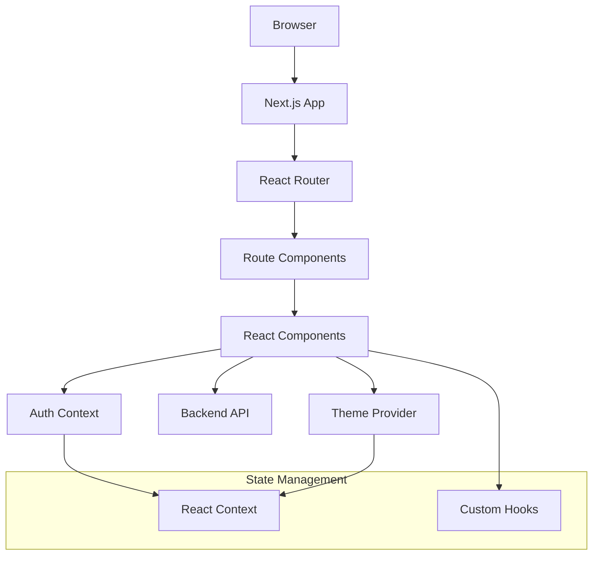

# Frontend Development

The Layer0 frontend is built with Next.js configured for client-side rendering with React Router, providing a modern, fast, and interactive user experience.

## Overview

The frontend serves as the user interface for the Layer0 application, featuring:

- ⚡ **Next.js 15** with React Router for client-side navigation
- 🎨 **Tailwind CSS** with shadcn/ui component library
- 🌓 **Dark/Light theme** support with next-themes
- 🔒 **Authentication integration** with Better Auth React
- 📱 **Responsive design** for all device sizes
- 🛡️ **Protected routes** with authentication context

## Architecture



## Project Structure

```
frontend/
├── src/
│   ├── app/                    # Next.js app directory
│   │   ├── layout.tsx          # Root layout
│   │   ├── not-found.tsx       # 404 page
│   │   ├── error.tsx           # Error boundary
│   │   └── shell/              # App shell
│   │       └── page.tsx        # Main app entry
│   ├── components/             # React components
│   │   ├── auth/               # Authentication components
│   │   │   ├── sign-in-form.tsx
│   │   │   ├── sign-up-form.tsx
│   │   │   └── protected-route.tsx
│   │   ├── providers/          # Context providers
│   │   │   ├── auth.tsx        # Auth context
│   │   │   └── index.tsx       # Provider composition
│   │   ├── theme/              # Theme components
│   │   │   ├── provider.tsx    # Theme provider
│   │   │   └── toggler.tsx     # Theme toggle button
│   │   └── ui/                 # Reusable UI components
│   ├── routes/                 # Route components
│   │   ├── auth.tsx            # Authentication page
│   │   ├── feed.tsx            # Main feed page
│   │   └── settings.tsx        # User settings
│   ├── hooks/                  # Custom React hooks
│   ├── lib/                    # Utility libraries
│   │   ├── auth.ts             # Auth client setup
│   │   ├── api.ts              # API client
│   │   └── utils.ts            # Utility functions
│   ├── config/                 # Configuration files
│   └── styles/                 # Global styles
└── package.json
```

## App Shell Setup

### Main App Entry

```typescript title="src/app/shell/page.tsx"
"use client";

import { BrowserRouter } from "react-router";
import App from "@/frontend/app";
import { Providers } from "@/components/providers";

export default function Shell() {
  return (
    <Providers>
      <BrowserRouter>
        <App />
      </BrowserRouter>
    </Providers>
  );
}
```

### Root Layout

```typescript title="src/app/layout.tsx"
import type { Metadata } from "next";
import { Inter } from "next/font/google";
import "@/styles/globals.css";

const inter = Inter({ subsets: ["latin"] });

export const metadata: Metadata = {
  title: "Layer0 - Modern Full-Stack Starter",
  description: "A modern full-stack starter kit with authentication",
};

export default function RootLayout({
  children,
}: {
  children: React.ReactNode;
}) {
  return (
    <html lang="en" suppressHydrationWarning>
      <body className={inter.className}>{children}</body>
    </html>
  );
}
```

## Routing Setup

### Main App Router

```typescript title="src/frontend/app.tsx"
"use client";

import { Routes, Route, Navigate } from "react-router";
import { useAuth } from "@/components/providers/auth";
import { Layout } from "@/components/layout";
import { ProtectedRoute } from "@/components/auth/protected-route";

// Route components
import AuthPage from "@/routes/auth";
import FeedPage from "@/routes/feed";
import SettingsPage from "@/routes/settings";

export default function App() {
  return (
    <Routes>
      <Route path="/" element={<Layout />}>
        {/* Public routes */}
        <Route index element={<Navigate to="/feed" replace />} />
        <Route path="/auth" element={<AuthPage />} />

        {/* Protected routes */}
        <Route
          path="/feed"
          element={
            <ProtectedRoute>
              <FeedPage />
            </ProtectedRoute>
          }
        />
        <Route
          path="/settings"
          element={
            <ProtectedRoute>
              <SettingsPage />
            </ProtectedRoute>
          }
        />

        {/* Catch all */}
        <Route path="*" element={<Navigate to="/feed" replace />} />
      </Route>
    </Routes>
  );
}
```

### Layout Component

```typescript title="src/components/layout.tsx"
"use client";

import { Outlet } from "react-router";
import { useAuth } from "@/components/providers/auth";
import { ThemeToggler } from "@/components/theme/toggler";
import { Button } from "@/components/ui/button";

export function Layout() {
  const { user, signOut } = useAuth();

  return (
    <div className="min-h-screen bg-background">
      {/* Navigation */}
      <nav className="border-b bg-background/95 backdrop-blur supports-[backdrop-filter]:bg-background/60">
        <div className="container mx-auto px-4 h-16 flex items-center justify-between">
          <div className="flex items-center space-x-4">
            <h1 className="text-xl font-bold">Layer0</h1>
          </div>

          <div className="flex items-center space-x-4">
            <ThemeToggler />

            {user ? (
              <div className="flex items-center space-x-4">
                <span className="text-sm">Welcome, {user.name}</span>
                <Button variant="outline" size="sm" onClick={() => signOut()}>
                  Sign Out
                </Button>
              </div>
            ) : null}
          </div>
        </div>
      </nav>

      {/* Main content */}
      <main className="container mx-auto px-4 py-8">
        <Outlet />
      </main>
    </div>
  );
}
```

## Authentication Components

### Sign In Form

```typescript title="src/components/auth/sign-in-form.tsx"
"use client";

import { useState } from "react";
import { useNavigate } from "react-router";
import { signIn } from "@/lib/auth";
import { Button } from "@/components/ui/button";
import { Card, CardContent, CardHeader, CardTitle } from "@/components/ui/card";

export function SignInForm() {
  const [email, setEmail] = useState("");
  const [password, setPassword] = useState("");
  const [loading, setLoading] = useState(false);
  const [error, setError] = useState("");
  const navigate = useNavigate();

  const handleSubmit = async (e: React.FormEvent) => {
    e.preventDefault();
    setLoading(true);
    setError("");

    try {
      await signIn.email({
        email,
        password,
      });
      navigate("/feed");
    } catch (err) {
      setError("Invalid credentials. Please try again.");
      console.error("Sign in failed:", err);
    } finally {
      setLoading(false);
    }
  };

  return (
    <Card className="w-full max-w-md">
      <CardHeader>
        <CardTitle>Sign In</CardTitle>
      </CardHeader>
      <CardContent>
        <form onSubmit={handleSubmit} className="space-y-4">
          {error && (
            <div className="p-3 text-sm text-red-600 bg-red-50 rounded-md dark:bg-red-900/20 dark:text-red-400">
              {error}
            </div>
          )}

          <div>
            <label htmlFor="email" className="block text-sm font-medium mb-2">
              Email
            </label>
            <input
              id="email"
              type="email"
              value={email}
              onChange={(e) => setEmail(e.target.value)}
              className="w-full px-3 py-2 border rounded-md focus:outline-none focus:ring-2 focus:ring-primary"
              required
            />
          </div>

          <div>
            <label
              htmlFor="password"
              className="block text-sm font-medium mb-2"
            >
              Password
            </label>
            <input
              id="password"
              type="password"
              value={password}
              onChange={(e) => setPassword(e.target.value)}
              className="w-full px-3 py-2 border rounded-md focus:outline-none focus:ring-2 focus:ring-primary"
              required
            />
          </div>

          <Button type="submit" className="w-full" disabled={loading}>
            {loading ? "Signing in..." : "Sign In"}
          </Button>
        </form>
      </CardContent>
    </Card>
  );
}
```

### Protected Route Component

```typescript title="src/components/auth/protected-route.tsx"
"use client";

import { useAuth } from "@/components/providers/auth";
import { useEffect } from "react";
import { useNavigate } from "react-router";

interface ProtectedRouteProps {
  children: React.ReactNode;
}

export function ProtectedRoute({ children }: ProtectedRouteProps) {
  const { user, loading } = useAuth();
  const navigate = useNavigate();

  useEffect(() => {
    if (!loading && !user) {
      navigate("/auth");
    }
  }, [user, loading, navigate]);

  if (loading) {
    return (
      <div className="flex items-center justify-center min-h-[200px]">
        <div className="animate-spin rounded-full h-8 w-8 border-b-2 border-primary"></div>
      </div>
    );
  }

  if (!user) {
    return null;
  }

  return <>{children}</>;
}
```

## Context Providers

### Auth Provider

```typescript title="src/components/providers/auth.tsx"
"use client";

import { createContext, useContext, useEffect, useState } from "react";
import { useSession, signOut as authSignOut } from "@/lib/auth";
import type { User } from "@/lib/auth";

interface AuthContextType {
  user: User | null;
  loading: boolean;
  signOut: () => Promise<void>;
}

const AuthContext = createContext<AuthContextType | undefined>(undefined);

export function AuthProvider({ children }: { children: React.ReactNode }) {
  const { data: session, isPending } = useSession();
  const [user, setUser] = useState<User | null>(null);

  useEffect(() => {
    setUser(session?.user ?? null);
  }, [session]);

  const handleSignOut = async () => {
    try {
      await authSignOut();
      setUser(null);
    } catch (error) {
      console.error("Sign out failed:", error);
    }
  };

  return (
    <AuthContext.Provider
      value={{
        user,
        loading: isPending,
        signOut: handleSignOut,
      }}
    >
      {children}
    </AuthContext.Provider>
  );
}

export function useAuth() {
  const context = useContext(AuthContext);
  if (context === undefined) {
    throw new Error("useAuth must be used within an AuthProvider");
  }
  return context;
}
```

### Provider Composition

```typescript title="src/components/providers/index.tsx"
"use client";

import { ThemeProvider } from "@/components/theme/provider";
import { AuthProvider } from "./auth";

export function Providers({ children }: { children: React.ReactNode }) {
  return (
    <ThemeProvider
      attribute="class"
      defaultTheme="system"
      enableSystem
      disableTransitionOnChange
    >
      <AuthProvider>{children}</AuthProvider>
    </ThemeProvider>
  );
}
```

## Route Components

### Feed Page

```typescript title="src/routes/feed.tsx"
"use client";

import { useState, useEffect } from "react";
import { useAuth } from "@/components/providers/auth";
import { Button } from "@/components/ui/button";
import { Card, CardContent, CardHeader } from "@/components/ui/card";
import { api } from "@/lib/api";

interface Post {
  _id: string;
  content: string;
  authorAuthId: string;
  createdAt: number;
  likesCount: number;
  commentsCount: number;
  imageUrl?: string;
}

export default function FeedPage() {
  const { user } = useAuth();
  const [posts, setPosts] = useState<Post[]>([]);
  const [loading, setLoading] = useState(true);
  const [newPost, setNewPost] = useState("");
  const [creating, setCreating] = useState(false);

  useEffect(() => {
    fetchPosts();
  }, []);

  const fetchPosts = async () => {
    try {
      const response = await api.get("/posts");
      setPosts(response.data.posts);
    } catch (error) {
      console.error("Failed to fetch posts:", error);
    } finally {
      setLoading(false);
    }
  };

  const createPost = async (e: React.FormEvent) => {
    e.preventDefault();
    if (!newPost.trim()) return;

    setCreating(true);
    try {
      const response = await api.post("/posts", {
        content: newPost.trim(),
      });
      setPosts([response.data.post, ...posts]);
      setNewPost("");
    } catch (error) {
      console.error("Failed to create post:", error);
    } finally {
      setCreating(false);
    }
  };

  if (loading) {
    return (
      <div className="flex items-center justify-center">
        <div className="animate-spin rounded-full h-8 w-8 border-b-2 border-primary"></div>
      </div>
    );
  }

  return (
    <div className="max-w-2xl mx-auto space-y-6">
      <h1 className="text-2xl font-bold">Feed</h1>

      {/* Create post form */}
      <Card>
        <CardHeader>
          <h2 className="text-lg font-semibold">What's on your mind?</h2>
        </CardHeader>
        <CardContent>
          <form onSubmit={createPost} className="space-y-4">
            <textarea
              value={newPost}
              onChange={(e) => setNewPost(e.target.value)}
              placeholder="Share something..."
              className="w-full px-3 py-2 border rounded-md resize-none focus:outline-none focus:ring-2 focus:ring-primary"
              rows={3}
            />
            <Button type="submit" disabled={creating || !newPost.trim()}>
              {creating ? "Posting..." : "Post"}
            </Button>
          </form>
        </CardContent>
      </Card>

      {/* Posts list */}
      <div className="space-y-4">
        {posts.length === 0 ? (
          <Card>
            <CardContent className="text-center py-8">
              <p className="text-muted-foreground">
                No posts yet. Be the first to share something!
              </p>
            </CardContent>
          </Card>
        ) : (
          posts.map((post) => (
            <Card key={post._id}>
              <CardContent className="pt-6">
                <div className="space-y-4">
                  <div className="flex items-center justify-between">
                    <span className="font-semibold">Author</span>
                    <span className="text-sm text-muted-foreground">
                      {new Date(post.createdAt).toLocaleDateString()}
                    </span>
                  </div>

                  <p className="text-lg">{post.content}</p>

                  {post.imageUrl && (
                    
                  )}

                  <div className="flex items-center space-x-4 text-sm text-muted-foreground">
                    <span>❤️ {post.likesCount} likes</span>
                    <span>💬 {post.commentsCount} comments</span>
                  </div>
                </div>
              </CardContent>
            </Card>
          ))
        )}
      </div>
    </div>
  );
}
```

## Styling and Theming

### Theme Provider Setup

```typescript title="src/components/theme/provider.tsx"
"use client";

import { ThemeProvider as NextThemesProvider } from "next-themes";
import type { ThemeProviderProps } from "next-themes/dist/types";

export function ThemeProvider({ children, ...props }: ThemeProviderProps) {
  return <NextThemesProvider {...props}>{children}</NextThemesProvider>;
}
```

### Theme Toggle Button

```typescript title="src/components/theme/toggler.tsx"
"use client";

import { Moon, Sun } from "lucide-react";
import { useTheme } from "next-themes";
import { Button } from "@/components/ui/button";

export function ThemeToggler() {
  const { theme, setTheme } = useTheme();

  return (
    <Button
      variant="outline"
      size="sm"
      onClick={() => setTheme(theme === "light" ? "dark" : "light")}
    >
      <Sun className="h-4 w-4 rotate-0 scale-100 transition-all dark:-rotate-90 dark:scale-0" />
      <Moon className="absolute h-4 w-4 rotate-90 scale-0 transition-all dark:rotate-0 dark:scale-100" />
      <span className="sr-only">Toggle theme</span>
    </Button>
  );
}
```

### Global Styles

```css title="src/styles/globals.css"
@import "tailwindcss";

@layer base {
  :root {
    --background: 0 0% 100%;
    --foreground: 222.2 84% 4.9%;
    --primary: 222.2 47.4% 11.2%;
    --primary-foreground: 210 40% 98%;
    --secondary: 210 40% 96%;
    --secondary-foreground: 222.2 84% 4.9%;
    --muted: 210 40% 96%;
    --muted-foreground: 215.4 16.3% 46.9%;
    --border: 214.3 31.8% 91.4%;
    --input: 214.3 31.8% 91.4%;
    --ring: 222.2 84% 4.9%;
  }

  .dark {
    --background: 222.2 84% 4.9%;
    --foreground: 210 40% 98%;
    --primary: 210 40% 98%;
    --primary-foreground: 222.2 47.4% 11.2%;
    --secondary: 217.2 32.6% 17.5%;
    --secondary-foreground: 210 40% 98%;
    --muted: 217.2 32.6% 17.5%;
    --muted-foreground: 215 20.2% 65.1%;
    --border: 217.2 32.6% 17.5%;
    --input: 217.2 32.6% 17.5%;
    --ring: 212.7 26.8% 83.9%;
  }
}

@layer base {
  * {
    @apply border-border;
  }

  body {
    @apply bg-background text-foreground;
  }
}
```

## Custom Hooks

### API Hook

```typescript title="src/hooks/use-api.ts"
"use client";

import { useState, useEffect } from "react";
import { api } from "@/lib/api";

export function useApi<T>(url: string, options?: RequestInit) {
  const [data, setData] = useState<T | null>(null);
  const [loading, setLoading] = useState(true);
  const [error, setError] = useState<string | null>(null);

  useEffect(() => {
    const fetchData = async () => {
      try {
        setLoading(true);
        const response = await api.get(url);
        setData(response.data);
      } catch (err) {
        setError(err instanceof Error ? err.message : "An error occurred");
      } finally {
        setLoading(false);
      }
    };

    fetchData();
  }, [url]);

  return { data, loading, error, refetch: () => setLoading(true) };
}
```

### File Upload Hook

```typescript title="src/hooks/use-file-upload.ts"
"use client";

import { useState } from "react";
import { api } from "@/lib/api";

export function useFileUpload() {
  const [uploading, setUploading] = useState(false);
  const [progress, setProgress] = useState(0);

  const uploadFile = async (file: File): Promise<string> => {
    setUploading(true);
    setProgress(0);

    try {
      const formData = new FormData();
      formData.append("file", file);

      const response = await api.post("/uploads/image", formData, {
        headers: {
          "Content-Type": "multipart/form-data",
        },
        onUploadProgress: (progressEvent) => {
          if (progressEvent.total) {
            const progress = (progressEvent.loaded / progressEvent.total) * 100;
            setProgress(Math.round(progress));
          }
        },
      });

      return response.data.url;
    } finally {
      setUploading(false);
      setProgress(0);
    }
  };

  return { uploadFile, uploading, progress };
}
```

## Development Workflow

### Development Server

```bash
# Start development server with Turbopack
pnpm dev

# Type checking
npx tsc --noEmit

# Linting
pnpm lint
```

### Building for Production

```bash
# Build the application
pnpm build

# Start production server
pnpm start
```

## Testing

### Component Testing

```typescript title="tests/components/auth/sign-in-form.test.tsx"
import { describe, it, expect, vi } from "vitest";
import { render, screen, fireEvent } from "@testing-library/react";
import { BrowserRouter } from "react-router";
import { SignInForm } from "@/components/auth/sign-in-form";

// Mock the auth lib
vi.mock("@/lib/auth", () => ({
  signIn: {
    email: vi.fn(),
  },
}));

describe("SignInForm", () => {
  it("renders sign in form", () => {
    render(
      <BrowserRouter>
        <SignInForm />
      </BrowserRouter>
    );

    expect(screen.getByLabelText(/email/i)).toBeInTheDocument();
    expect(screen.getByLabelText(/password/i)).toBeInTheDocument();
    expect(
      screen.getByRole("button", { name: /sign in/i })
    ).toBeInTheDocument();
  });

  it("submits form with email and password", async () => {
    const { signIn } = await import("@/lib/auth");

    render(
      <BrowserRouter>
        <SignInForm />
      </BrowserRouter>
    );

    fireEvent.change(screen.getByLabelText(/email/i), {
      target: { value: "test@example.com" },
    });
    fireEvent.change(screen.getByLabelText(/password/i), {
      target: { value: "password123" },
    });
    fireEvent.click(screen.getByRole("button", { name: /sign in/i }));

    expect(signIn.email).toHaveBeenCalledWith({
      email: "test@example.com",
      password: "password123",
    });
  });
});
```

## Performance Optimization

### Code Splitting

Next.js automatically handles code splitting, but you can also use dynamic imports:

```typescript
import { lazy } from "react";

const SettingsPage = lazy(() => import("@/routes/settings"));

// Use with Suspense
<Suspense fallback={<div>Loading...</div>}>
  <SettingsPage />
</Suspense>;
```

### Image Optimization

```typescript
import Image from "next/image";

function PostImage({ src, alt }: { src: string; alt: string }) {
  return (
    <Image
      src={src}
      alt={alt}
      width={600}
      height={400}
      className="rounded-md"
      priority={false}
    />
  );
}
```

## Next Steps

<Cards>
  <Card title="Backend Integration" href="/docs/backend" icon="⚡">
    Connect to the Hono backend APIs
  </Card>
  <Card title="Component Library" href="/docs/components" icon="🧩">
    Explore the UI component system
  </Card>
  <Card title="State Management" href="/docs/state-management" icon="🗃️">
    Advanced state management patterns
  </Card>
  <Card title="Testing Guide" href="/docs/testing" icon="🧪">
    Comprehensive frontend testing
  </Card>
</Cards>
