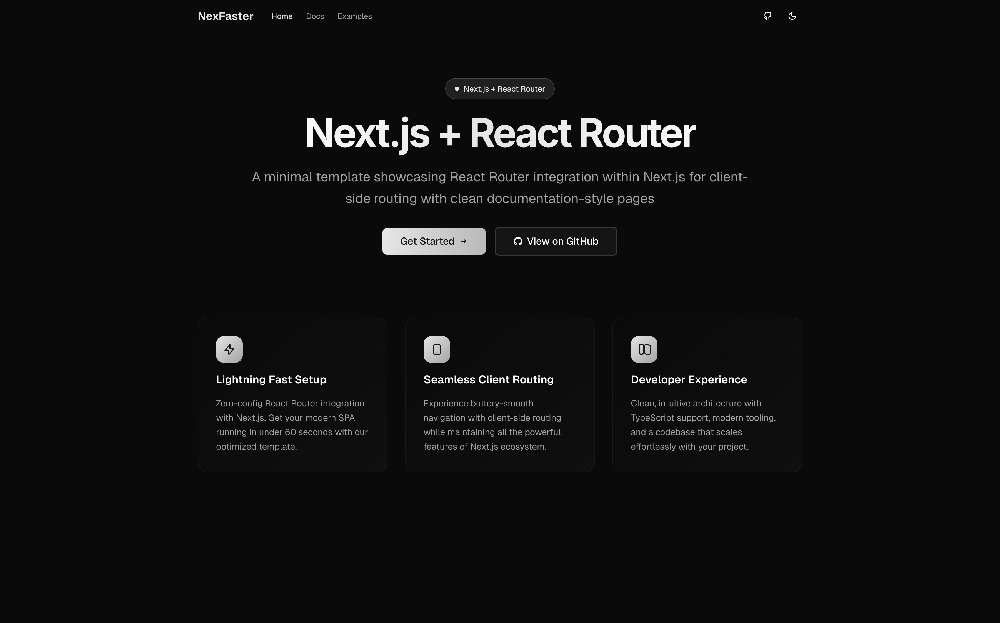

# Layer0

A modern social media starter kit built on Next.js with React Router client-side navigation and Hono Node.js backend

> Built on top of [NexFaster](https://github.com/rudrodip/nexfaster) - A minimal template showcasing React Router integration within Next.js for client-side routing. Special thanks to [@rds_agi](https://github.com/rudrodip) for the innovative Next.js + React Router navigation foundation.



## 🚀 Quick Start

```bash
git clone https://github.com/your-repo/layer0
cd layer0
pnpm install
pnpm dev
```

Open [http://localhost:3000](http://localhost:3000) to see the app.

## 🏗️ Architecture

Layer0 combines Next.js with React Router for pure client-side routing:

1. **Route Redirection**: All routes redirect to `/shell` via `next.config.ts`
2. **Shell Loading**: Shell page loads React Router app with `ssr: false`
3. **Client Routing**: React Router handles all navigation client-side

## 📁 Key Files

- `next.config.ts` - Route redirection configuration
- `src/app/shell/page.tsx` - Loads React Router app
- `src/frontend/app.tsx` - Main React Router application
- `src/config/site.config.ts` - Site configuration
- `src/components/boilerplate.tsx` - Layout and page components

## 🔧 Adding Routes

Add new routes in `src/frontend/app.tsx`:

```tsx
<Route path="/your-page" element={<YourPage />} />
```

## 🎨 Features

- ⚡ Lightning fast client-side routing
- 🎯 Zero-config React Router integration
- 🎨 Modern UI with Tailwind CSS and Threads-like design
- 🌙 Dark mode support
- 📱 Mobile-first responsive design
- 🔧 TypeScript support
- 💬 Social media features (posts, likes, comments)
- 🚀 Full-stack ready with Hono backend

## 🛠️ Tech Stack

- **Framework**: Next.js 15
- **Routing**: React Router 7
- **Backend**: Hono.js
- **Styling**: Tailwind CSS
- **UI Components**: shadcn/ui
- **Icons**: Lucide React
- **Language**: TypeScript
- **Package Manager**: pnpm

## 📖 Usage Examples

### Social Media Features

```tsx
<Route path="/feed" element={<Feed />} />
<Route path="/profile/:username" element={<Profile />} />
<Route path="/post/:id" element={<PostDetail />} />
```

### Multi-page App

```tsx
<Route path="/products" element={<ProductList />} />
<Route path="/products/:id" element={<ProductDetail />} />
<Route path="/cart" element={<ShoppingCart />} />
```

### Protected Routes

```tsx
<Route
  path="/dashboard"
  element={
    <ProtectedRoute>
      <Dashboard />
    </ProtectedRoute>
  }
/>
```

### Nested Layouts

```tsx
<Route path="/admin" element={<AdminLayout />}>
  <Route path="users" element={<UserManagement />} />
  <Route path="settings" element={<Settings />} />
</Route>
```

## 🤝 Contributing

Contributions are welcome! Please feel free to submit a Pull Request.

## 📄 License

BSD Zero Clause License - see [LICENSE](LICENSE) for details.

## 👤 Author

Created by [rds_agi](https://rdsx.dev) • [GitHub](https://github.com/rudrodip/layer0) • [Twitter](https://x.com/rds_agi)
